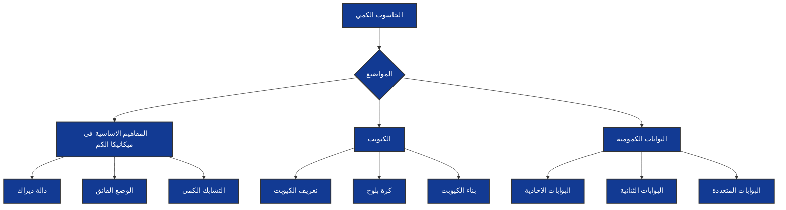

# وصف الوحدة 

بعد اتمام  هذه الوحدة،  ستتعلم بعض المفاهيم الأساسية في ميكانيكا الكم والتي تشكل أساساً للحوسبة الكمومية، بدءًا من مفهوم الوضع الفائق، وصولاً إلى التشابك الكمي، بالإضافة إلى بعض الرموز والمعادلات الفيزيائية التي ستواجهها مستقبلاً.

بالاضافة الى انك  ستتعرف على مفهوم الكيوبت من جوانب مختلفة وبشكل مفصل
و  ستحصل على معلومات شاملة حول بعض  البوابات الكمومية مثل بوابات هادامارد وبوابات بولي . ستتعلم كيفية استخدام هذه البوابات لتنفيذ العمليات الكمومية المختلفة على حالة الكيوبتات.

[link_text](xref:uid_of_Quantum_computer\Basic_concepts_in_quantum_mechanics\Superposition.md)