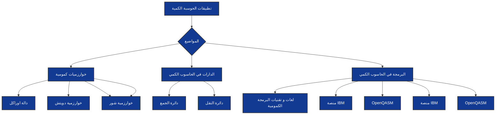

# وصف الوحدة 

بعد اكمال هذه الوحدة، ستحصل على شرح مفصل لبعض الخوارزميات الكمومية مثل خوارزمية جروفر وخوارزمية شور و خوارزمية دويتش . كما ستتعرف على كيفية تنفيذ هذه الخوارزميات لحل بعض المشاكل باستخدام الحوسبة الكمومية.

بالإضافة إلى ذلك، ستحصل على  شرحًا كافيًا حول بعض الدوائر في الحوسبة الكمومية و على مكوناتها  المختلفة للدوائر الكمومية وكيفية تفاعلها لتنفيذ العمليات الكمومية المعقدة

ستحصل أيضًا على معلومات عن مجموعة من التقنيات واللغات البرمجية الكمومية المختلفة 

وأخيرًا، ستحصل على شرح حول كيفية استخدام بعض المنصات المتاحة لمحاكاة الحوسبة الكمومية وستتعلم كيفية استخدام منصات مثل IBM Quantum Experience ومنصة Qiskit لتجربة ومحاكاة الحوسبة الكمومية.

