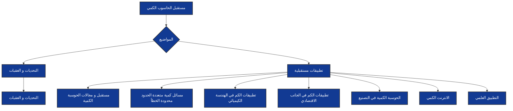

# وصف الوحدة 

في هذه الوحدة، سنركز على المرحلة الحالية لتطوير الحوسبة الكمومية والتحديات والعقبات المختلفة التي تواجهها. ستتعلم عن الجهود الحالية لبناء الحوسبة الكمومية، بما في ذلك تصميم وبناء الكيوبتات والدوائر الكمومية المتقدمة.

سنستكشف التحديات التي تواجه عملية تطوير الحوسبة الكمومية، مثل تحقيق الاستقرار والتحكم الدقيق في الكيوبتات، وإدارة الضوضاء الكمومية والأخطاء الناجمة عن التداخل الكمومي. ستتعرف أيضًا على التحديات التي تواجه تطوير أجهزة القياس الكمومية والتحكم في التشابك الكمي.

بعد ان اطلعنا على العديد من المشاكل التي تواجه تطوير الحاسوب الكمي و مدى التحديات التي تقف أمام البشرية في عملية التطوير
فإن هذه التحديات و العقبات لن تمنعنا من النظر إلى الستقبل و مدى التطور و التقدم الذي سيقدمه 
بالإضافة إلى ذلك، ستتعلم عن بعض التطبيقات المثيرة للاهتمام في مجال الحوسبة الكمومية. ستستكشف كيف يمكن للحوسبة الكمومية أن تحل مشاكل تفوق قدرات الحوسبة التقليدية، مثل تحسين عمليات البحث والتحسيب والتحليل البياني. ستتعلم عن استخدام الحوسبة الكمومية في مجالات مثل الكيمياء الكمومية وتحليل البيانات و في الجانب الاقتصادي
و العلمي وغيرها الكثير 

[ التحديات ](http://docfx_project/Challenges_and_hindrances\Challenges.md)

[مسائل كمية متعددة الحدود محدودة الخطأ  ](xref:future_of_quantum_computing\future_applications\BQP.md)
