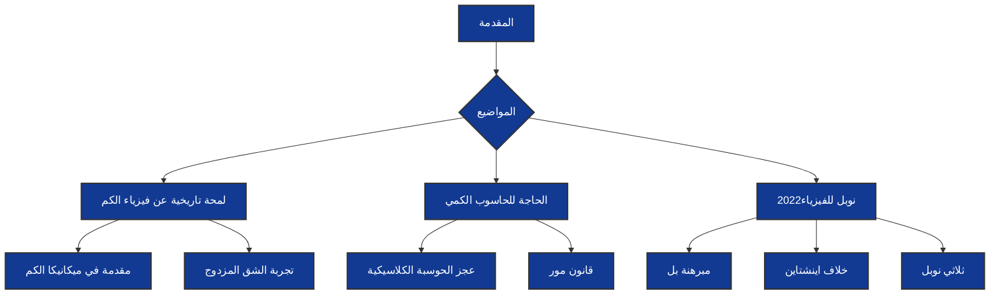

# وصف الوحدة 

بعد اتمام هذه الوحدة، ستكتسب معلومات حول التطور التاريخي لميكانيكا الكم، بدءًا من ظهور فكرة الذرة وتطورها عبر الزمن حتى ولادة علم ميكانيكا الكم.

سنتعرف على فكرة الذرة التي اقترحها جون دالتون في القرن التاسع عشر، وكيف تطورت الأفكار حول الذرة وهياكلها في القرن العشرين. سنتعلم عن نموذج بور للذرة الذي وضعه نيلز بور والذي يشمل فكرة الإلكترونات الموجودة في مدارات محددة حول النواة الذرية.

سنتطرق أيضًا إلى نظرية ميكانيكا الموجات ومساهمات علماء مثل إرفين شرودينغر وويرنر هايزنبرغ في تطويرها. هذه النظرية تصف الجسيمات الصغيرة بوصفها موجات وتعطي احتمالية وجودها في مواقع معينة، وهي أساسية في فهم ميكانيكا الكم.

سنتناول أيضًا تجربة الشق المزدوج، وهي تجربة أجريت في القرن العشرين لدراسة سلوك الضوء والجسيمات الصغيرة. ستتعرف على كيفية أن الجسيمات يمكن أن تكون في حالة ذرية وموجية في نفس الوقت، مما يدعم النظرية الموجية في ميكانيكا الكم.

وبعض المعلومات حول جائزة نوبل للفيزياء لعام 2022 والمساهمات الهامة التي قدمها العلماء والتي صبت في تطوير علم الحاسوب الكمي         

<!-- theme -->
<!-- %%{init: {'theme': 'base', 'themeVariables': { 'primaryColor': '#ff0000'}}}%% -->
